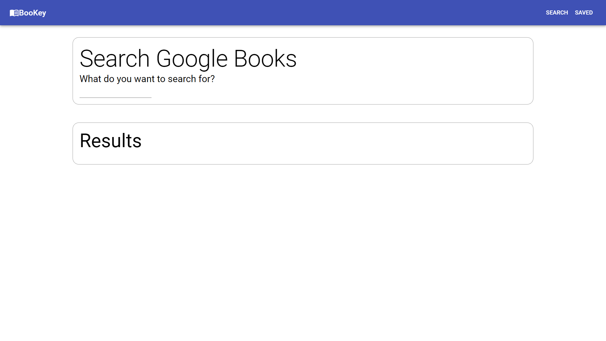
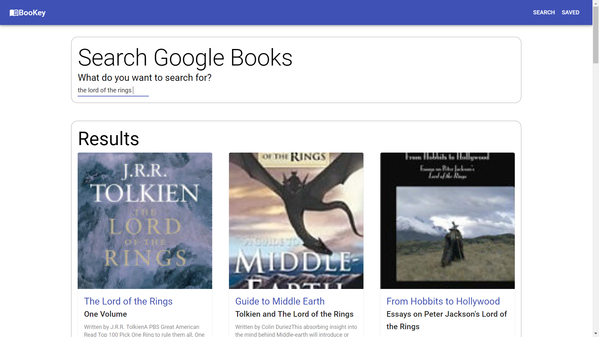
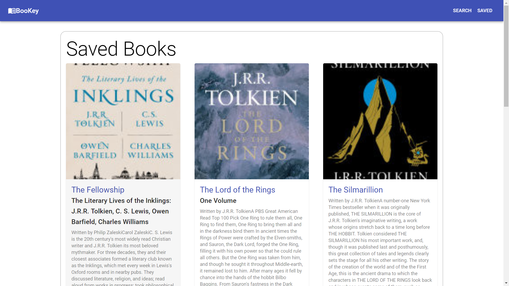

        

# Bookey
This app is your key to searching through and saving Google books.

     

#### [Deployed App](#)

## Concept
As a reader, I want to search Google Books for quality book information so that I can quickly find books to read and where to purchase them.

## Local Installation and Usage
1. Install the required modules by typing "npm install" or "npm i" using your code editor terminal; must be at the same level as the package.json.
    * Should you want to seed the app with a few books, at the root of the app, use command "npm run seed".
2. Run the app by typing "npm start", "node server.js", or "node server."
3. The console log will display "Server listening on: http://localhost:3000 ."
4. React should automatically open a webpage on your default browser. Should this not happen, you can hold control and click on the address to go directly to the app. App will open to the search page.
5. Using the app: 
    * Start searching for books by typing in the input. Books will appear in the results section.
    * If you want to save a book, simply click on that book's save button. 
    * If you want to view your saved books, navigate to the page by clicking the saved button in the top right corner.
    * If you want to buy the book or simply view more info about the book, click on the book's title to navigate to the book's Google Play e-book page.
    * To remove a book from your saved list, simply click on that book's delete button. 

## Tech Utilized
* React
* HTML
* CSS
* Javascript
* jQuery
* Material-UI
* Node
* NPM
* Express
* FS
* MongoDB

## Future Development
* Better image formmatting - currently the images appear zoomed in. Would like to work with Material-ui styling to create clearer images of the book covers. 
* Authentication system - Would like to develop a login/profile system. Currently this app supports one user/list of books. Would be great if multiple users can have their own lists.
* Various lists of books - user can categorize their book saves. 
* Read book button - user can move a book to their "read books" list and add a review/notes for themselves or others to read. 
* Connect to a library system - would be awesome to also search a library for books. Would need to change db links from around the name & image to buttons. So you would have a "buy book" and a "borrow book" button.

## Credits
* App heavily influenced by activities through my current bootcamp [(Univeristy of Oregon's Coding BootCamp)](https://bootcamp.uoregon.edu/) - particularly Week 21, Activity 5. 
* Material-UI - utilized many of their components. 

## License

MIT License

Copyright (c) 2020 Laurie J Schroeder

Permission is hereby granted, free of charge, to any person obtaining a copy
of this software and associated documentation files (the "Software"), to deal
in the Software without restriction, including without limitation the rights
to use, copy, modify, merge, publish, distribute, sublicense, and/or sell
copies of the Software, and to permit persons to whom the Software is
furnished to do so, subject to the following conditions:

The above copyright notice and this permission notice shall be included in all
copies or substantial portions of the Software.

THE SOFTWARE IS PROVIDED "AS IS", WITHOUT WARRANTY OF ANY KIND, EXPRESS OR
IMPLIED, INCLUDING BUT NOT LIMITED TO THE WARRANTIES OF MERCHANTABILITY,
FITNESS FOR A PARTICULAR PURPOSE AND NONINFRINGEMENT. IN NO EVENT SHALL THE
AUTHORS OR COPYRIGHT HOLDERS BE LIABLE FOR ANY CLAIM, DAMAGES OR OTHER
LIABILITY, WHETHER IN AN ACTION OF CONTRACT, TORT OR OTHERWISE, ARISING FROM,
OUT OF OR IN CONNECTION WITH THE SOFTWARE OR THE USE OR OTHER DEALINGS IN THE
SOFTWARE.